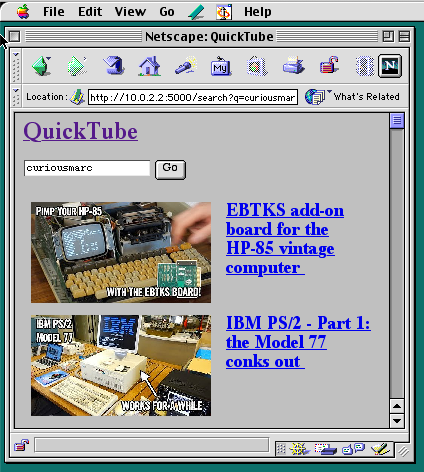
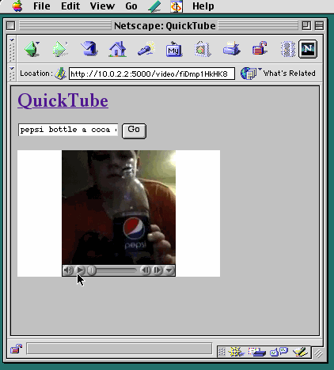

# quicktube

quicktube is a Flask application that proxies YouTube using `youtube-dl` and transcodes/downscales the videos with `ffmpeg` to a format supported by QuickTime 3.0 (Sorenson Video with ADPCM for the audio). It then embeds the converted video in a plain HTML 3.0 document for viewing using your favorite old school browser (Netscape 4, IE for Mac, etc.)

I've tested this on a PowerBook 3400c and it plays at the full 15fps, reports from people using other machines are welcome.

## Disclaimer

This is a total hack and is not production-ready yet. If you run this, do it on your LAN and don't open it up to the Internet.

## TODO

* Stream videos instead of downloading/transcoding first
* Use bindings for ffmpeg and youtube-dl instead of invoking the command line utils
* The thumbnail proxy feature currently turns your machine into an open http proxy
* Pick up where we left off on partially downloaded source videos?
* General code cleanup and refactoring

## Screenshots

## License

MIT
